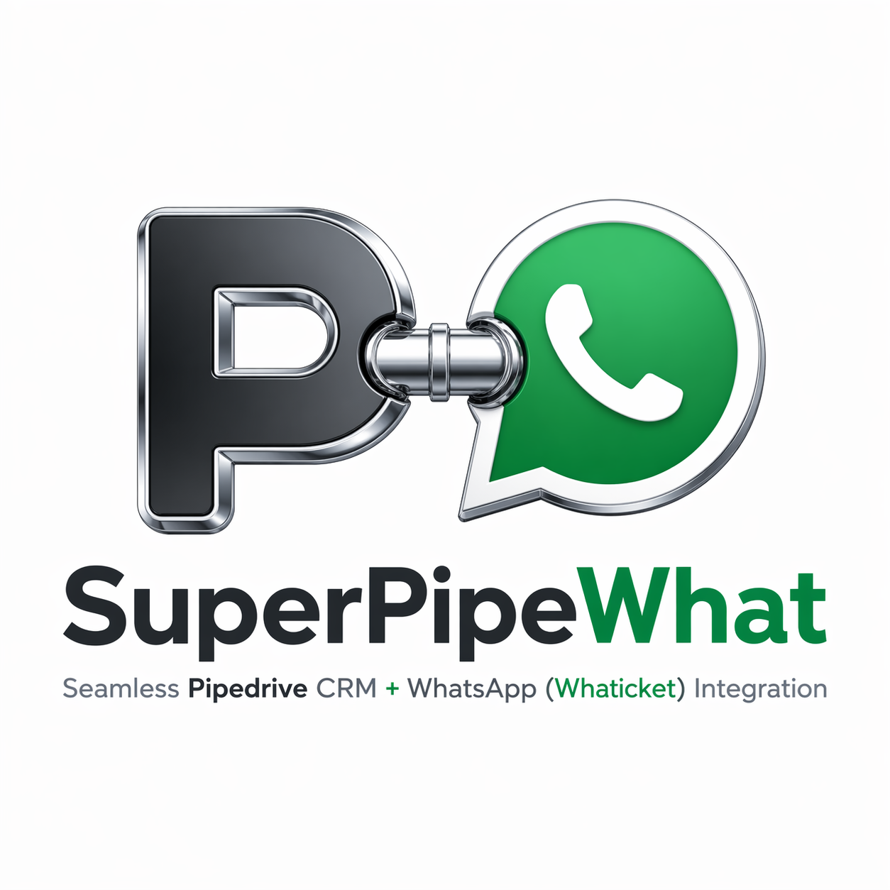

<p align="center">
  
</p>

# SuperPipeWhat

**Un puente bidireccional entre [Pipedrive](https://www.pipedrive.com/) y [Whaticket](https://whaticket.com/) en una sola extensión de Chrome.** Dos integraciones complementarias que cubren el agujero que deja la falta de integración oficial entre ambas plataformas:

- 📥 **En Whaticket** — panel lateral con los datos del contacto en Pipedrive (deals, timeline, próxima actividad). Creá notas, actividades, deals, editá etapa/valor, marcá won/lost, mandá email con BCC tracked — todo sin salir del chat.
- 📤 **En Pipedrive** — botón flotante (o iconos inline) para enviar WhatsApp vía Whaticket desde cualquier deal, lead, persona u organización. Plantillas con variables, envío masivo desde vistas de lista, adjuntos.

Extensión Chrome Manifest V3. Un único install atiende ambos dominios y decide qué lógica cargar según la página activa. Sin servidores propios, sin tracking, sin telemetría.

Hecha por [marketingfraccional.com](https://marketingfraccional.com) · Pedro Knigge.

> Esta extensión unifica y reemplaza a los proyectos predecesores [PipeWhat](https://github.com/pedroknigge/pipewhat) y [WhatPipe](https://github.com/pedroknigge/whatpipe).

---

## ¿Por qué?

Los equipos comerciales y de atención usan Pipedrive para el pipeline y Whaticket para conversar por WhatsApp. Pero **no existe integración oficial entre ambos**: quien atiende copia números a mano, pega en Whaticket, vuelve a Pipedrive a actualizar el deal, pierde trazabilidad. Con SuperPipeWhat:

- Desde Whaticket, mientras chateás, ves el pipeline del contacto y operás sobre Pipedrive en la misma pantalla.
- Desde Pipedrive, mandás WhatsApp sin salir del deal, con plantillas personalizadas y envío masivo.

---

## ✨ Qué hace

### 📥 Panel de Pipedrive dentro de Whaticket

Se inyecta en `*.whaticket.com`. Pestaña **PD** pegada al borde derecho.

**Lectura**

- Detección automática del teléfono del chat (URL, `tel:` links, header) con búsqueda en Pipedrive probando múltiples variantes (con/sin código de país, con/sin el `9` móvil argentino, últimos 8–10 dígitos).
- Persona con nombre, empresa, dueño, teléfonos y emails. Click en tel/email copia al portapapeles.
- Deals asociados con `Pipeline · Etapa`, status pill (open/won/lost) y valor.
- Banner con la **próxima actividad pendiente** y botón `✓ Hecha`.
- **Timeline del deal** con íconos por tipo (📞 llamada, 🤝 reunión, ✅ tarea, ✉️ email, 📝 nota, 📎 archivo, 🔄 cambio). Notas con *Ver más/menos*, archivos clickeables, cambios de stage con nombre real.

**Escritura** (con confirmación propia, sin `confirm()` bloqueante)

- **+ Nota** al deal.
- **+ Actividad** con presets rápidos o custom.
- **✎ Editar deal**: cambiar etapa (filtrada por pipeline), valor + moneda, reasignar dueño, marcar 🏆 Won, marcar ❌ Lost con razón de pérdida.
- **+ Nuevo deal** con selector pipeline+etapa dependientes.
- **+ Tel** / **+ Email** que *mergea* con los contactos existentes.
- **📧 Email** por deal: form inline que arma un `mailto:` con tu **Smart BCC** de Pipedrive — el mail queda loggeado automáticamente en el deal.
- **+ Crear persona en Pipedrive** cuando el teléfono del chat no matchea.

**Responsive**

- Ancho default `clamp(320, 440, 30% viewport)`, auto-colapsado en pantallas <1100px.
- Modo compacto automático con container queries cuando el panel mide ≤380px.
- Resize handle arrastrable (300–900px) con ancho persistido.
- El chat de Whaticket se encoge en vez de quedar tapado.

### 📤 Envío WhatsApp desde Pipedrive

Se inyecta en `*.pipedrive.com`. Botón flotante 📱 abajo a la derecha (o iconos inline).

- **Atajo `Alt+Shift+W`** para abrir el modal desde cualquier vista.
- **Detección de contacto**: por DOM (fallback) o por API de Pipedrive (preciso, requiere token).
- **Plantillas** con variables: `{{nombre}}`, `{{apellido}}`, `{{nombre_completo}}`, `{{empresa}}`, `{{mi_empresa}}`, `{{email}}`, `{{deal}}`, `{{owner}}`.
- **Adjuntos por plantilla** (imagen, PDF, audio vía URL).
- **Envío masivo**: marcá varias filas en una vista de lista (Negocios, Leads, Personas) y aparece un botón **"Enviar a N"** que resuelve cada destinatario contra la API de Pipedrive y personaliza la plantilla **por contacto**. Log en vivo con OK/fallos, intervalo configurable, podés frenar en cualquier momento.
- **Modal arrastrable**; se vuelve transparente mientras lo movés.
- **Modo del botón**: flotante (default) o inline (iconito verde al lado de cada número de teléfono).
- **Guardar como plantilla** desde el propio modal con un click.

---

## ⌨️ Atajos

| Dónde | Atajo | Acción |
|---|---|---|
| Whaticket | `Alt + Shift + P` | Colapsar / expandir el panel de Pipedrive |
| Pipedrive | `Alt + Shift + W` | Abrir modal de envío Whaticket |

---

## 🛠 Instalación

1. Cloná este repo (o descargalo como ZIP).
2. En Chrome: `chrome://extensions` → activar **Modo desarrollador**.
3. Click en **Cargar extensión sin empaquetar** → seleccionar la carpeta `SuperPipeWhat/`.
4. Click al ícono de la extensión → **Opciones** y configurá las credenciales (ver abajo).

### Configuración inicial

**Pestaña Pipedrive (panel dentro de Whaticket)**

- **Subdominio**: si tu URL es `miempresa.pipedrive.com`, poné `miempresa`.
- **Token de API** de Pipedrive: *Configuración → Preferencias personales → API*.
- **Código de país por defecto** (opcional pero recomendado): ej. `54` para AR. Se usa en las dos integraciones.
- **Smart Email BCC** (opcional): tu BCC personal de Pipedrive (*Email sync*). Activa el tracking automático de mails enviados desde el panel.
- **Whaticket self-hosted** (opcional): si tu Whaticket corre en un dominio propio, autorizalo acá. Chrome te va a pedir permiso explícito.

**Pestaña Whaticket (FAB dentro de Pipedrive)**

- **Token de Whaticket**: creá uno en [app.whaticket.com/tokens](https://app.whaticket.com/tokens) con permisos `create:messages` y `read:whatsapps`.
- **Conexión por defecto**: "Cargar conexiones" y elegí una de la lista.
- **Tu empresa**: nombre usado como `{{mi_empresa}}` en plantillas.
- **Modo del botón**: flotante o inline.

**Pestaña Plantillas**

Vienen 3 plantillas base en rioplatense. Editá o agregá las tuyas. Los cambios se sincronizan en vivo entre pestañas.

---

## 🏗 Arquitectura

Extensión **Manifest V3** con dos `content_scripts` — uno por dominio — y un service worker único que hace de router.

```
SuperPipeWhat/
├── manifest.json         MV3, dos content_scripts disjuntos
├── background.js         Service worker — Pipedrive API + Whaticket API + commands + migración
├── content/
│   ├── whaticket.js      Panel Pipedrive en *.whaticket.com
│   ├── whaticket.css
│   ├── pipedrive.js      FAB / modal de envío en *.pipedrive.com
│   └── pipedrive.css
├── options.html / .js    4 tabs: Pipedrive · Whaticket · Plantillas · Ayuda
├── popup.html / .js      Estado en vivo de ambas integraciones + banner contextual
└── icons/
```

- **Permisos mínimos**: `storage`, `scripting` + `host_permissions` para `*.pipedrive.com`, `*.whaticket.com`, `api.whaticket.com`. Sin `tabs`, `activeTab`, ni nada más.
- **Los tokens nunca llegan al content script**: todas las llamadas a APIs pasan por el service worker. Los content scripts sólo ven las respuestas parseadas.
- **Cache en memoria** (TTL 5 min) para Pipedrive: `persons/search`, `persons/{id}`, `persons/{id}/deals`, `deals/{id}/flow`, `/stages`, `/pipelines`. Invalidación precisa al escribir.
- **XSS-safe**: el content script de Whaticket renderea todo con `createElement` + `textContent` (nunca `innerHTML` con datos de terceros).
- **SPA-friendly**: `MutationObserver` + polling de URL para detectar cambios de chat en Whaticket y cambios de página en Pipedrive sin recarga.

### APIs usadas

**Pipedrive** (`https://<tu-dominio>.pipedrive.com/api/v1`)

| Método | Path | Uso |
|---|---|---|
| GET | `/persons/search?term=<phone>&fields=phone` | Buscar persona por teléfono |
| GET | `/persons/{id}` + `/persons/{id}/deals` | Bundle del contacto |
| GET | `/deals/{id}/flow?limit=15` | Timeline del deal |
| GET | `/stages`, `/pipelines`, `/users` | Catálogos |
| GET | `/deals/{id}`, `/leads/{id}`, `/organizations/{id}` | Lookup desde el FAB de Pipedrive |
| POST | `/notes`, `/activities`, `/deals`, `/persons` | Crear |
| PUT | `/deals/{id}`, `/persons/{id}`, `/activities/{id}` | Editar |

**Whaticket** (`https://api.whaticket.com/api/v1`)

| Método | Path | Uso |
|---|---|---|
| GET | `/whatsapps` | Listar conexiones |
| POST | `/messages` | Enviar mensaje (con o sin `mediaUrl`) |

---

## 🔒 Privacidad

- Tokens (Pipedrive y Whaticket) se guardan **únicamente** en `chrome.storage.local` de tu navegador.
- Los content scripts inyectados en Whaticket y Pipedrive **no tienen acceso a los tokens** — delegan todo al service worker.
- SuperPipeWhat **no usa servidores propios ni de terceros**. No hay tracking, analytics ni telemetría.
- Los mails enviados desde el panel salen desde **tu propio cliente de mail** (Gmail, Outlook, Apple Mail) — la extensión sólo arma el `mailto:` con el Smart BCC para el tracking de Pipedrive.
- Los únicos endpoints externos a los que llega la extensión son la **API de Pipedrive** y la **API de Whaticket**.

---

## 🗺 Roadmap

- [ ] Paginación de deals cuando la persona tiene > 20.
- [ ] Adjuntar archivos al deal desde el panel.
- [ ] Campos custom del deal/persona.
- [ ] Log de envíos masivos como notas en Pipedrive.
- [ ] i18n (EN, PT).
- [ ] Privacy policy + publicación en Chrome Web Store.

PRs y sugerencias bienvenidas.

---

## Créditos

By **[marketingfraccional.com](https://marketingfraccional.com)** · Pedro Knigge.

## Licencia

[MIT](./LICENSE).
